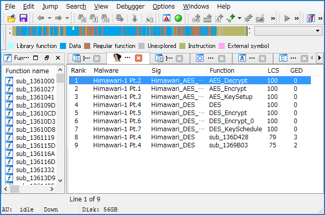

Here is the only simple README document in this repository.
Please, refer to the following official URL to download this tool.

* [Download - NTT Security](https://www.nttsecurity.com/ja-jp/Resources)
* [CryptGrep](https://www.nttsecurity.com/docs/librariesprovider3/resources/cryptgrep)

## Description

'CryptGrep' is an IDA python script which makes it possible to search a cryptographic function to analyze malware rapidly. The same malware family usually use the same cryptographic algorithm, and don't change their algorithm and implementation so frequently. Therefore, CryptGrep adopted signature based approach. Our approach also uses improved 'BinGrep' algorithm that was specialized for cryptographic function using several heuristic technique. And several pre-set signatures for typical malware are here. The usage is very simple and easy. And if you need additional signature, you can also create your original signature using your malware.

## Version

CryptGrep v1.0

## Requirement

* IDA Pro 6.x, 7.x
* Python 2.7

### cryptgrep.py

This script finds cryptographic functions that are implemented in binary file by comparing between 'CryptGrep' signatures and malware. This can be executed in GUI of IDA Pro. The usage is very simple.

* Open malware with IDA Pro and run cryptgrep.py.
    * "File" -> "Script file" (or Alt-F7).
    * Select "cryptgrep.py".

* The output will be shown in new tab.

## License

The 3-Clause BSD License

## Author

Copyright 2018, Hiroki Hada and Tomonori Ikuse
All rights reserved.

